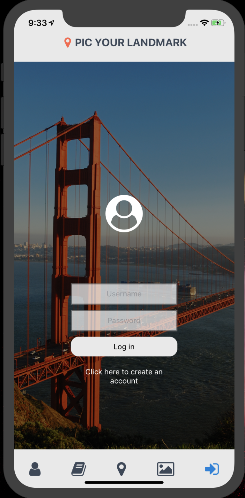
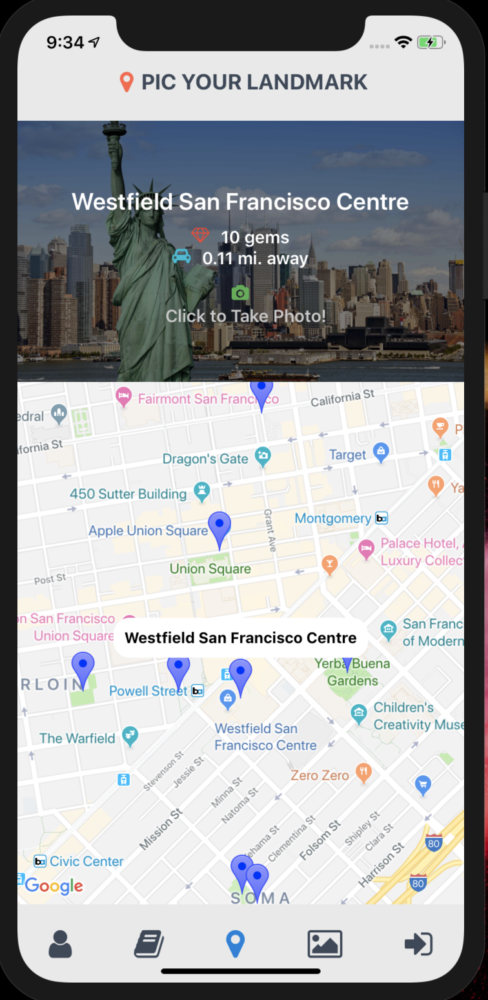
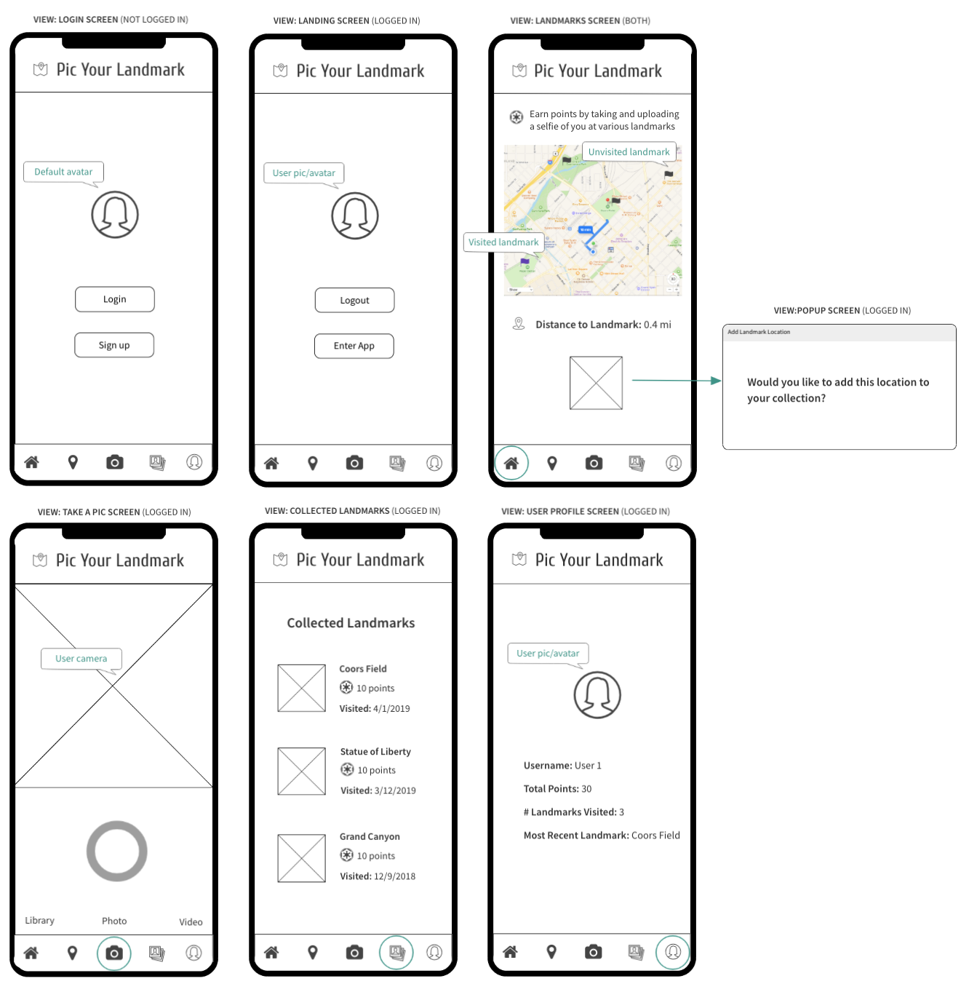

# Pic Your Landmark

Pic Your Landmark is a native app based on the famous game 'Pokemon Go' - except our users can 'collect' famous landmarks! When a user visits a landmark, they can take and store their picture in our app. Users gain points/gems based on how many landmarks they have 'collected'. They can show off their status as well as collection of photos to their friends and family. 

### Set-Up:
**Back end**  
[Back-end repo](https://github.com/jpclark6/PicYourLandmarkAPI)  

**Front end**  
Clone this repo  
Run `npm install` from the root directory  
Run `npm start` to view on mobile device  

### Preview:

### Primary Technologies Used:
* Waffle (planning FE/BE)
* React-Native-Expo (FE)
* Travis CI (FE)
* Django (BE)
* Rest_framework (BE)
* PostgreSQL (BE)
* Heroku (BE)

### Front-end Testing:
Jest and Enzyme for front-end testing  
Run `npm test` from the root directory of this front-end repo

### Original Assignment: 
[Cross-pollination](http://frontend.turing.io/projects/capstone.html) project from Turing School of Software and Design  

### Contributors:
[Matthew Foxwell (front end)](https://github.com/foxwellm)  
[Heather Hartley (front end)](https://github.com/hlhartley)   
[Justin Clark(back end)](https://github.com/jpclark6)  

### Wireframes:

### Future Enhancements:
- Add a splash page 
- Allow users to view other peoples' profiles and pictures
- Store pictures in AWS S3
- Add OAuth for convenient user login
- Password hashing/security
